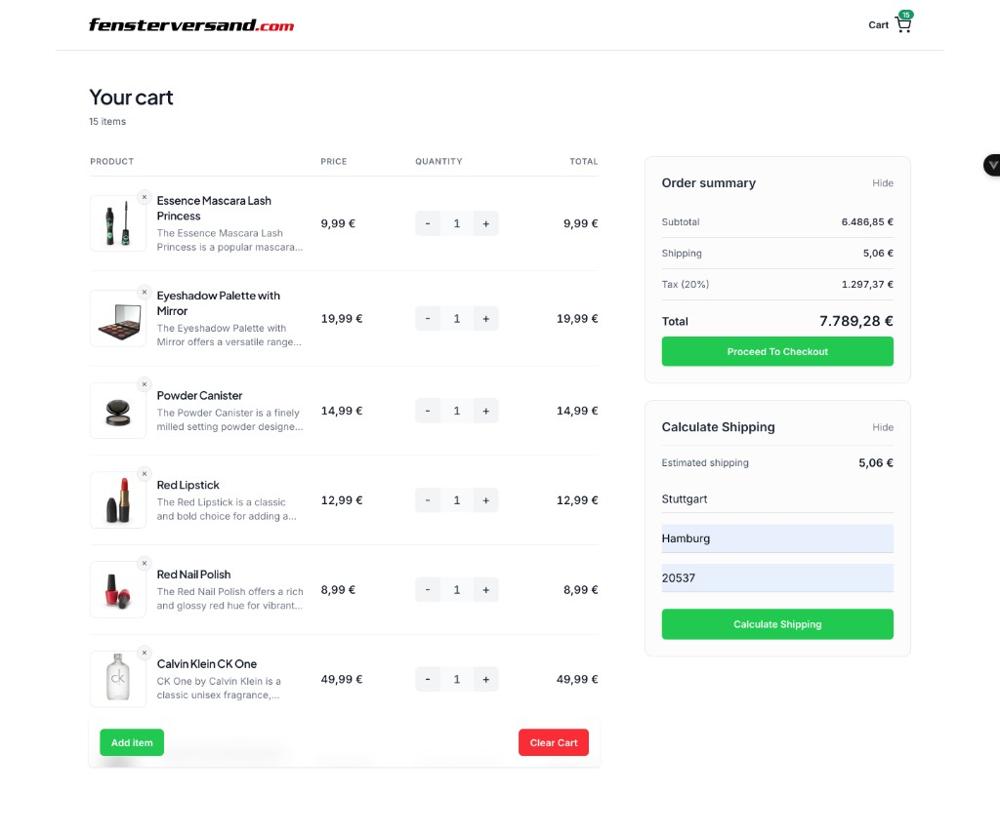
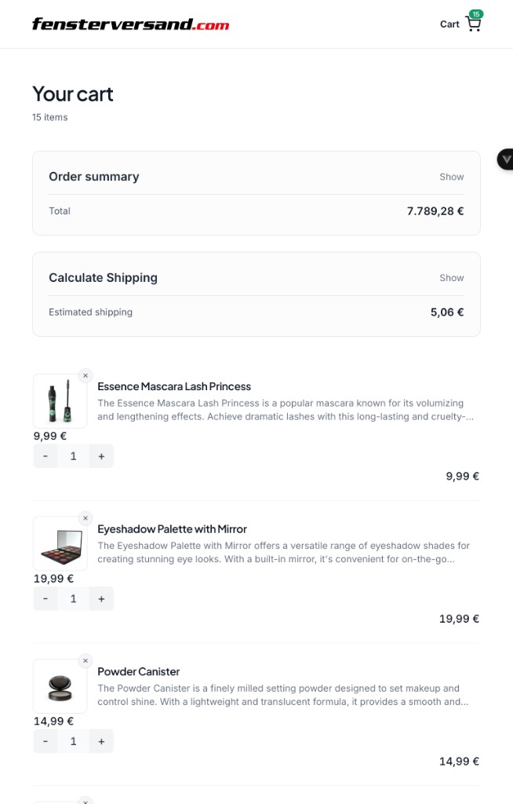
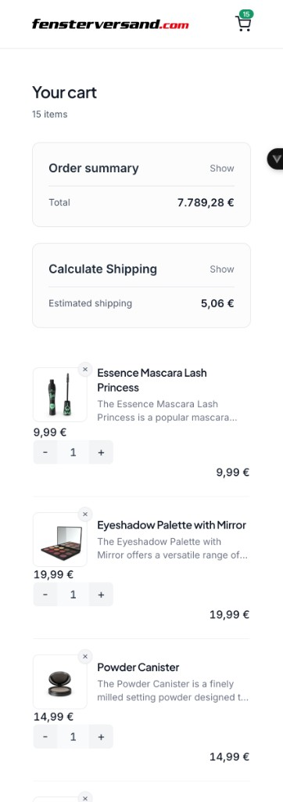

# Cart App

Demo shopping cart built for the Neuffer frontend take-home task: fetch products, adjust quantities, view totals (subtotal, tax, shipping), and checkout confirmation. UI layout follows the [Figma mockup](https://www.figma.com/design/2mppTVDIBBU2h7JLmUhmNs/Test-Task-Cart?node-id=0-1) (structure and general appearance, not pixel-perfect).

- **Live demo:** [Vercel](https://shopping-cart-kappa-pink.vercel.app)
- **Repository:** [GitHub](https://github.com/ahmadykhan555/shopping-cart)

## Screenshots

### Desktop



### Tablet



### Mobile



## Features

### Core (task requirements)

| Requirement                | Implementation                                                                                                                                 |
| -------------------------- | ---------------------------------------------------------------------------------------------------------------------------------------------- |
| Load initial cart from API | `GET` [DummyJSON products](https://dummyjson.com/docs/products) (`limit` from `MAX_CART_ITEMS`) on cart page mount                             |
| Display line items         | Image, title, description, unit price, quantity, line total                                                                                    |
| Adjust quantity            | `QuantitySelector` with min/max clamping and direct numeric input                                                                              |
| Remove item                | Remove control on each line                                                                                                                    |
| Clear cart                 | Clears items and shipping; success toast                                                                                                       |
| Add item                   | `POST` to DummyJSON `products/add` with a generated payload (`createDummyCartItem`); response merged into local cart with a client-assigned id |
| Subtotal & 20% tax         | Computed in `useCart` `summary`                                                                                                                |
| Proceed to checkout        | Navigates to success page with order summary; cart cleared after successful navigation                                                         |
| Responsive layout          | Collapsible summary/shipping on smaller viewports; grid layout on desktop                                                                      |

### Bonus / extras

- **Shipping UI** — Form with validation (`useFormValidation`); mocked cost via random value in configured range
- **Totals** — Subtotal + shipping + tax in order summary
- **Toasts** — Success/error feedback (Notivue) for cart actions and API errors
- **Checkout success** — Dedicated page with confetti; order summary passed via router `state` for the success route
- **Tests** — Unit and component tests for cart logic, API helper, and key UI (see [Testing](#testing))
- **Loading & empty states** — Skeleton loader and empty-cart CTA

Cart state lives in a shared composable (see [Technical decisions](#technical-decisions)).

## Quick manual check

1. Open `/cart` and wait for products to load.
2. Change quantity on a line; confirm line total and order summary update.
3. Remove an item and use **Clear cart** (empty state + add CTA).
4. **Add item** — POST runs; a new line appears with the demo payload price.
5. **Calculate Shipping** — fill the form, submit; shipping row updates totals.
6. **Proceed to checkout** — success page shows summary; return via **Back to cart**.

## How to run

Requires **Node.js ≥ 20** (see `.nvmrc`).

```bash
nvm use
pnpm install
pnpm run dev          # http://localhost:5173
pnpm run test         # Vitest watch mode (interactive)
pnpm run test:run     # single run, exits (CI-friendly)
pnpm run test:coverage
pnpm run build        # vue-tsc + production bundle
pnpm run preview      # serve production build locally
```

## Tech stack

- **Framework:** Vue 3 (Composition API) + TypeScript
- **Routing:** Vue Router
- **Styling:** Tailwind CSS
- **Bundler:** Vite
- **UI feedback:** [Notivue](https://notivue.netlify.app/) (toasts)
- **Checkout success:** [canvas-confetti](https://www.npmjs.com/package/canvas-confetti)
- **Testing:** Vitest, Testing Library, jsdom
- **Package manager:** pnpm

## Architecture

### Directory structure

```
src/
├── assets/           # Global styles, logo, SVG icon components
├── components/
│   ├── base/         # Shared layout/UI (header, button)
│   ├── cart/         # Cart-specific UI (items, summary, shipping, states)
│   └── __tests__/    # Component tests
├── composables/      # Shared logic (cart, API, forms, toasts)
│   └── __tests__/    # Composable unit tests
├── consts/           # App constants (API URLs, cart limits, routes)
├── pages/            # Route-level views (cart, checkout success)
├── test/             # Vitest setup and render helpers
├── types/            # TypeScript domain types
├── utils/            # Pure helpers (money formatting, cart math)
├── App.vue           # Root layout (header + router outlet + toast host)
├── main.ts           # App bootstrap
└── router.ts         # Vue Router config
```

### Composables (`src/composables/`)

- **`useCart`** — Cart items, loading flags, computed `summary`, fetch/add/remove/qty/shipping/checkout helpers
- **`useApi`** — Shared `fetch` wrapper, error messages, error toasts
- **`useFormValidation`** — Field rules and touch/submit validation (shipping calculator)
- **`useToast`** — Thin wrapper around Notivue success/error toasts

### Data flow

Cart data is centralized in **`useCart`** (shared composable state). Components use two patterns, depending on depth:

- **Direct composable access** — `AppHeader` and `CartSummary` call `useCart()` for totals and flags without prop drilling through `CartPage`.
- **Props down, events up** — `CartPage` passes each line as an `item` prop to `CartItem`, passes disabled flags to `CartActions`, passes `shippingCost` to `CartShippingCostCalculator`, and wires `@updateItemQuantity`, `@click:removeItem`, `@addItem`, `@clearCart`, `@update:shippingCost` → `saveShippingCost`, and `@click:checkout` (router navigation + `emptyCart`) to `useCart` / the router. `QuantitySelector` stays presentational (quantity in, `update:quantity` out).

`CartPage` owns route-level orchestration (fetch on mount, layout, loading/empty vs list). Leaf UI stays testable; sidebar and header read the same reactive cart as the list.

### Components

**Base** (`src/components/base/`)

- **`AppHeader`** — Logo link and cart link with unit-count badge
- **`AppButton`** — Shared button variants (primary, secondary, danger, ghost)

**Cart** (`src/components/cart/`)

- **`CartLoadingState`** — Skeleton while items load
- **`CartEmptyState`** — Empty message and add-item CTA
- **`CartItemsColumnHeaders`** — Desktop column labels
- **`CartItem`** — Single line: image, details, price, quantity, line total, remove
- **`QuantitySelector`** — +/- and numeric input with clamping
- **`CartActions`** — Add item and clear cart (sticky footer on list view)
- **`CartSummary`** — Subtotal, shipping, tax, total; emits `click:checkout` with order state; collapsible on small screens
- **`CartSummaryItem`** — Summary row (also used on checkout success)
- **`CartShippingCostCalculator`** — Shipping form, validation; emits `update:shippingCost` with calculated cost

**Pages** (`src/pages/`)

- **`CartPage`** — Main route (`/cart`; `/` redirects here): loads products into cart on mount, arranges summary/shipping aside and line-item list, and delegates actions to `useCart` and child components (orchestration only, not cart business logic)
- **`CheckoutSuccessPage`** — Post-checkout confirmation; reads order summary from router `history.state`, shows confetti, redirects to cart when state is missing or invalid

### Domain rules

- **Initial catalog:** Up to **`MAX_CART_ITEMS` (15)** products from the API; prices come from DummyJSON
- **Tax:** 20% on subtotal only (shipping excluded from tax base)
- **Item count:** Header badge, cart page subtitle, and checkout use total **units** (`summary.count` = sum of line quantities), not number of lines
- **Money:** Formatted as EUR via `Intl` (`de-DE`)
- **Quantity:** Clamped between `MIN_QUANTITY` and `MAX_QUANTITY` (see `src/consts/cart.ts`)
- **Add-item demo:** **Add item** uses `createDummyCartItem` with fixed **`DUMMY_CART_ITEM_UNIT_PRICE` (10)** for predictable tests; catalog lines keep API prices

### Accessibility (selected)

- Loading skeleton exposes `role="status"` / `aria-busy`
- Remove buttons and primary actions use descriptive `aria-label`s
- Shipping inputs use `aria-invalid` and `aria-describedby` for errors

## Technical decisions

Choices below match the take-home scope: one cart flow, a small set of routes, and no order backend.

### Rendering (CSR)

The app is a client-rendered SPA (Vite + Vue Router). The task centers on an interactive cart page and checkout confirmation, not content indexing or server-driven HTML.

**When SSR or SSG would be worth it:** Marketing pages that must rank in search, first-paint performance budgets on slow devices, or embedding cart in a larger SSR host (e.g. Nuxt).

### Products API (DummyJSON)

The brief specifies FakeStore-style `GET`/`POST` product endpoints. FakeStoreAPI was unavailable (522 errors); after alignment with the hiring team, [DummyJSON](https://dummyjson.com) fulfills the same integration pattern.

| Task spec          | This app                |
| ------------------ | ----------------------- |
| `GET` products     | `GET /products?limit=…` |
| `POST` add product | `POST /products/add`    |

Cart contents are held in app state after the initial fetch, which matches how the task describes populating and mutating the cart locally. DummyJSON returns a hardcoded id on add, so newly added lines use **client-assigned ids** (`getNextItemId`) for unique ids, to keep the list consistent in the UI.

### State management (`useCart`)

Cart state lives in module-level `ref`s exposed through a single `useCart` composable. A few components and pages read the same cart, totals, and flags without prop drilling.

**Why this fits here:** One domain (cart), a handful of mutations, and straightforward computed summary—no cross-feature stores or plugins.

**When [Pinia](https://pinia.vuejs.org/) would be a better fit:** Multiple independent slices (auth, catalog, cart, checkout) with shared devtools; persisted cart or user sessions; middleware/plugins; larger teams standardizing on a store pattern; or splitting logic across many routes and lazy-loaded chunks where explicit store modules aid navigation.

### API layer (`useApi`)

HTTP calls go through one `apiCall` helper: shared defaults, mapped error messages, and user-facing toasts. Cart fetch/add stay focused on data mapping in `useCart`.

**Why this fits here:** Only two endpoints and one consistent error UX for the demo.

### Checkout flow

The task asks for checkout as a simple confirmation, not payment processing. The app navigates to a success route with the order summary in router `state`, then clears the cart after navigation succeeds.

**Why this fits here:** No order API; reviewers can complete the flow in one click from the live demo.

## Testing

| Area        | Files                                                                                                            |
| ----------- | ---------------------------------------------------------------------------------------------------------------- |
| Cart logic  | `src/composables/__tests__/useCart.test.ts` — totals, quantity clamp, shipping, fetch/add failure, id assignment |
| HTTP helper | `src/composables/__tests__/useApi.test.ts` — success path, errors, toasts                                        |
| Form validation | `src/composables/__tests__/useFormValidation.test.ts` — touch/submit gating, required and custom rules       |
| UI          | `src/components/__tests__/` — `CartSummary`, `CartActions`, `AppHeader`, `QuantitySelector`, `AppButton`           |

Use **`pnpm run test:run`** for a single pass, **`pnpm run test`** for watch mode, or **`pnpm run test:coverage`** for coverage.

## Known limitations

- No cart persistence (refresh on `/cart` re-fetches the product catalog into cart state)
- Failed initial load shows an error toast and leaves the cart empty until a successful fetch (e.g. reload)
- **Add item** POSTs a generated demo payload; it is not selecting a new product from the catalog
- Shipping cost is mocked (form fields validate but do not affect the random cost algorithm)
- Checkout summary is tied to router `state` for that navigation (reload on `/checkout-success` redirects to cart)
- No payment or order backend
- Unknown routes redirect to the cart (no dedicated 404 page)
- Tests focus on cart logic, API helper, and primary UI paths—not exhaustive E2E coverage
